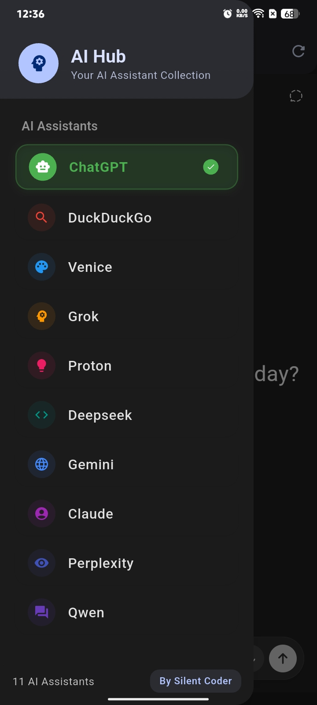
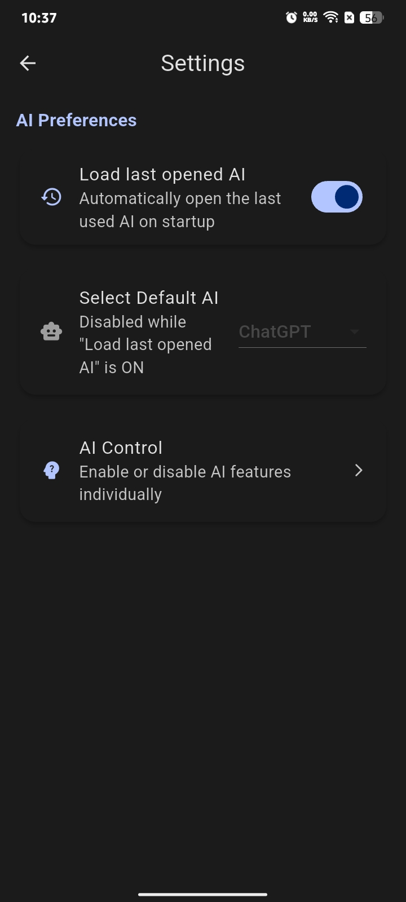
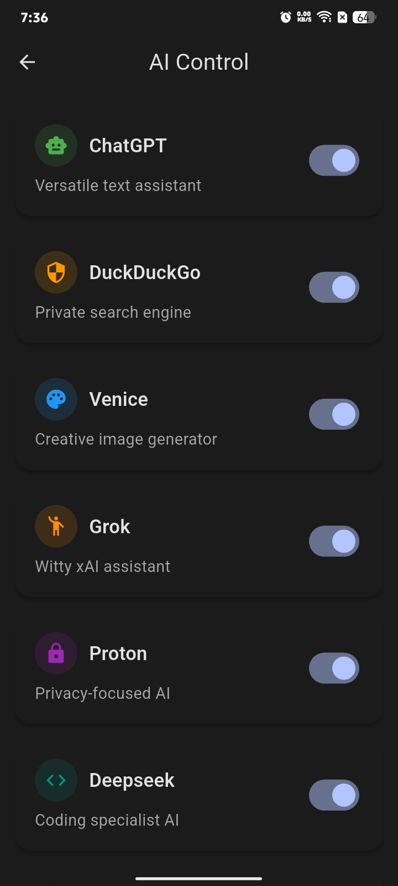
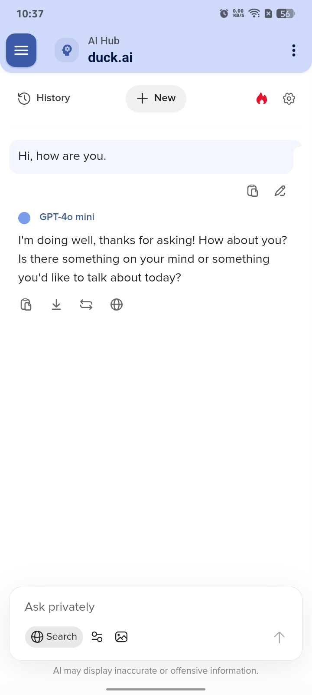
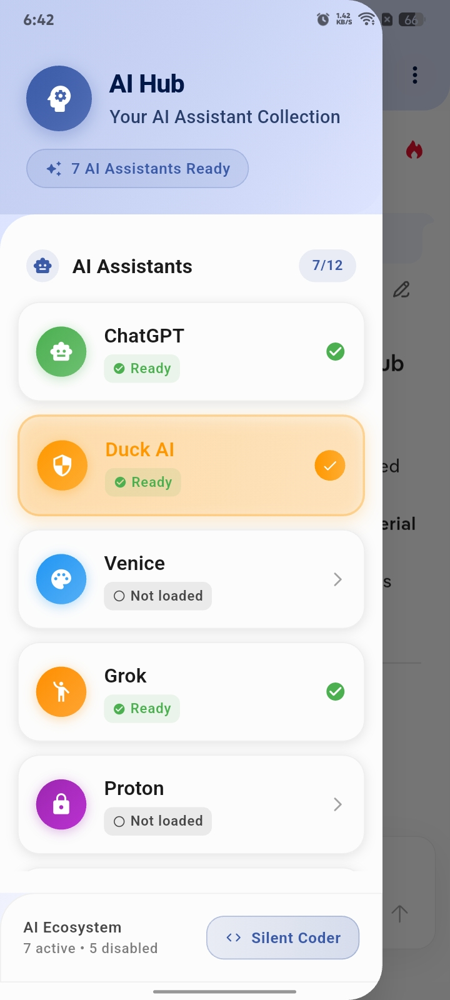
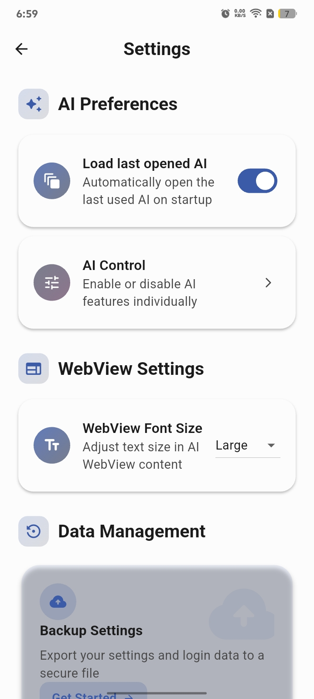
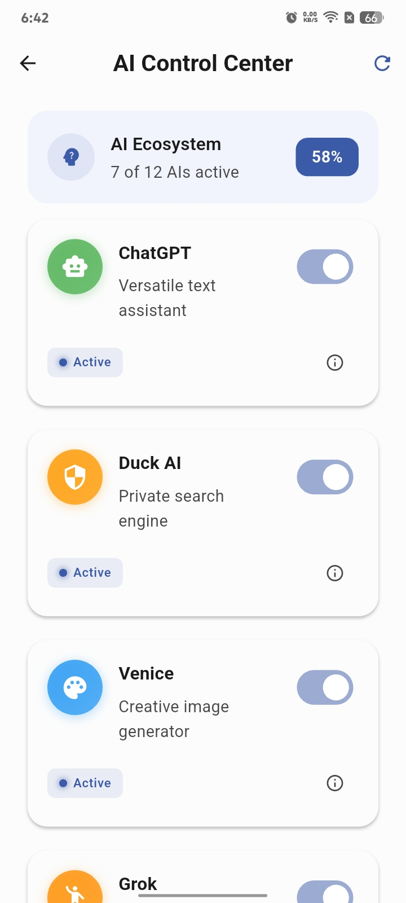

# 🤖 AI Hub

  
  
  
  
  
  

---

### 🧠 Overview

**AI Hub** is a lightweight Flutter app that brings multiple AI assistants together in one simple interface.  
It uses Material Design 3, automatic theme detection, and built-in WebView with session restore for a smooth experience.

---

## ✨ Features

| Feature | Description |
|:--------|:-------------|
| 🎨 **Material You (MD3)** | Adaptive, clean, and modern interface |
| 🌙 **Dark & Light themes** | Matches your system theme automatically |
| 🌐 **WebView integration** | Run AI assistants directly in the app |
| 💾 **Session memory** | Reopens the last AI you used |
| 🪄 **Tabbed layout** | Switch between assistants easily |
| ⚡ **Smooth & fast** | Optimized for quick loading and use |

---

## 📸 Screenshots

### 🌙 Dark Theme

  
  
  
  

---

### ☀️ Light Theme

  
  
  
  

---

## 🔧 Planned Additions

- 🚫 Ad and tracker blocker  
- ☁️ Backup and restore for cookies and preferences  
- ⚙️ Option to enable/disable AI tabs  

---

## 💡 Contributing

Pull requests, small UI fixes, and new ideas are always welcome.  
To start contributing, fork this repo, make your changes, and open a pull request.

---

## ⭐ Support

If you find **AI Hub** useful, please **star ⭐**.

---

## 📜 License

Licensed under the **GNU General Public License v3.0 (GPLv3)**.  
See [LICENSE](LICENSE) for details.
