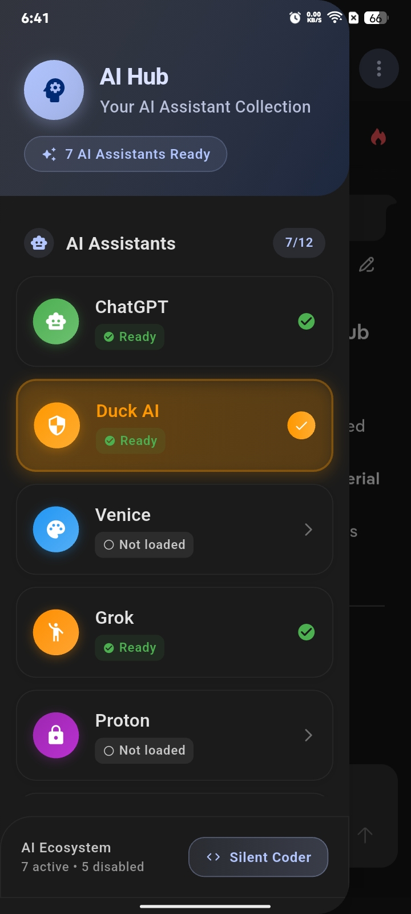
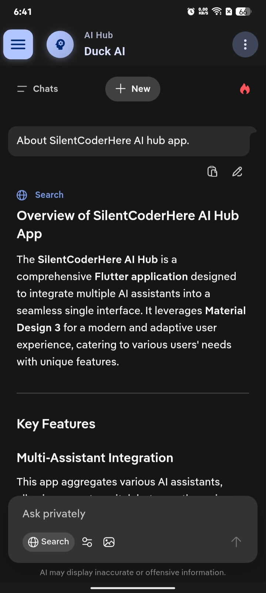
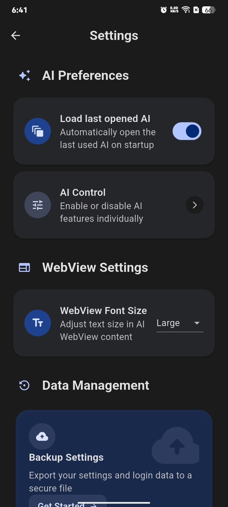
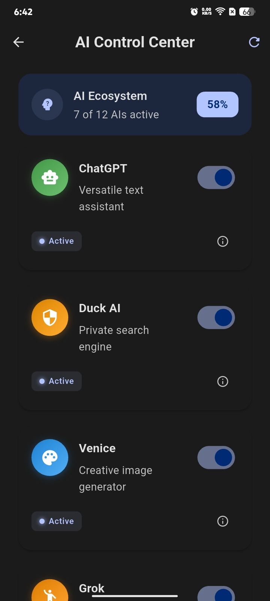
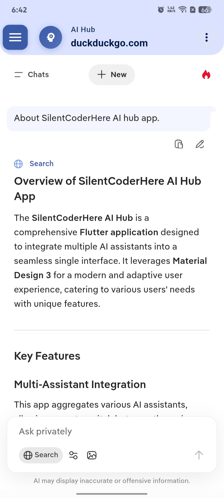
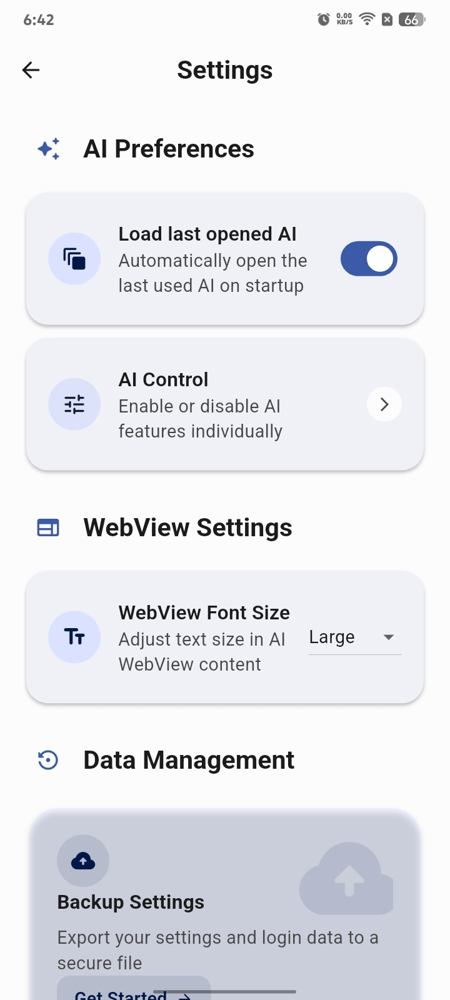

# 🤖 AI Hub

  
  
  
  
  
  

---

### 🧠 Overview

>__I built this app for my personal use, but my friends like it and have recommended that I upload it to GitHub, even though updates are not frequent for various reasons.__

**AI Hub** is a clean, simple multi-AI app built with MD3.

It supports dynamic colors, theme match, tab switching, background running, text control, and data backup.

---

## ⭐ Features

| Feature | Description |
|:--------|:-------------|
| 🎨 **Material You (MD3)** | Clean and modern UI |
| 🌈 **Dynamic Coloring** | UI colors adapt to your wallpaper (Material You) |
| 🌗 **Dark & Light themes** | Follows your phone theme |
| 🗂️ **Tabbed layout** | Switch between AIs easily |
| 🔁 **Background switching** | Other AIs keep running while you switch |
| 📦 **Backup & Restore** `(Experimental)` | Save and load your app data |
| 🚫 **Disable AIs** | Turn off any AI you don’t want |
| 🔤 **Font size control** | Adjust WebView text size |

---

## 🙄 I Failed

> I tried my best to implement a tracker blocker by restricting unnecessary connections. After putting in a lot of hard work, I was unable to successfully restrict those connections.

**I would be thankful to anyone who can implement this feature correctly.**

## 📥 Get the App

<!--  -->
  
[](obtainium://app/%7B%22id%22%3A%22com.foss.aihub%22%2C%22url%22%3A%22https%3A%2F%2Fgithub.com%2FSilentCoderHere%2FAI-hub%22%2C%22author%22%3A%22Silent%20Coder%22%2C%22name%22%3A%22AI%20Hub%22%2C%22preferredApkIndex%22%3A0%2C%22additionalSettings%22%3A%22%7B%5C%22includePrereleases%5C%22%3Afalse%2C%5C%22fallbackToOlderReleases%5C%22%3Atrue%2C%5C%22filterReleaseTitlesByRegEx%5C%22%3A%5C%22%5C%22%2C%5C%22filterReleaseNotesByRegEx%5C%22%3A%5C%22%5C%22%2C%5C%22verifyLatestTag%5C%22%3Afalse%2C%5C%22dontSortReleasesList%5C%22%3Afalse%2C%5C%22useLatestAssetDateAsReleaseDate%5C%22%3Afalse%2C%5C%22trackOnly%5C%22%3Afalse%2C%5C%22versionExtractionRegEx%5C%22%3A%5C%22%5C%22%2C%5C%22matchGroupToUse%5C%22%3A%5C%22%5C%22%2C%5C%22versionDetection%5C%22%3Atrue%2C%5C%22releaseDateAsVersion%5C%22%3Afalse%2C%5C%22useVersionCodeAsOSVersion%5C%22%3Afalse%2C%5C%22apkFilterRegEx%5C%22%3A%5C%22%5C%22%2C%5C%22invertAPKFilter%5C%22%3Afalse%2C%5C%22autoApkFilterByArch%5C%22%3Atrue%2C%5C%22appName%5C%22%3A%5C%22AI%20Hub%5C%22%2C%5C%22exemptFromBackgroundUpdates%5C%22%3Afalse%2C%5C%22skipUpdateNotifications%5C%22%3Afalse%2C%5C%22about%5C%22%3A%5C%22A%20simple%20app%20for%20AIs%20that%20offers%20everything%20in%20one%20place.%5C%22%2C%5C%22appAuthor%5C%22%3A%5C%22Silent%20Coder%5C%22%7D%22%7D)  

---

## 📸 Screenshots

### 🌙 Dark Theme

  
  
  
  

---

### ☀️ Light Theme

  
  
  
  

---

## ❤️ Credits

- **[gptAssist](https://github.com/woheller69/gptAssist)** — Gave me the idea of how to block or stop non-essential network connections and requests inside the app.
- **[Assistral](https://github.com/shano/assistral)** — Provided a helpful list of essential Mistral connection URLs, which I used to improve my own app’s connection handling.
- **[Jay Kumar](https://github.com/Jesterdotcom)** — Supported the project by testing the app and motivating me to continue improving it.

---

## 😉 Special Thanks

- **[Nora](https://github.com/nonbili/Nora)** — Gave me the idea for a simple multi-AI interface.
- **[Flutter](https://flutter.dev/)** — The framework that helped me build the app.
- **[Material Design 3](https://m3.material.io/)** — The design style used for the app’s UI.

## 💡 Contributing

Pull requests, small UI fixes, and new ideas are always welcome.  
To start contributing, fork this repo, make your changes, and open a pull request.

---

## ⭐ Support

If you find **AI Hub** useful, please **star ⭐**.

---
